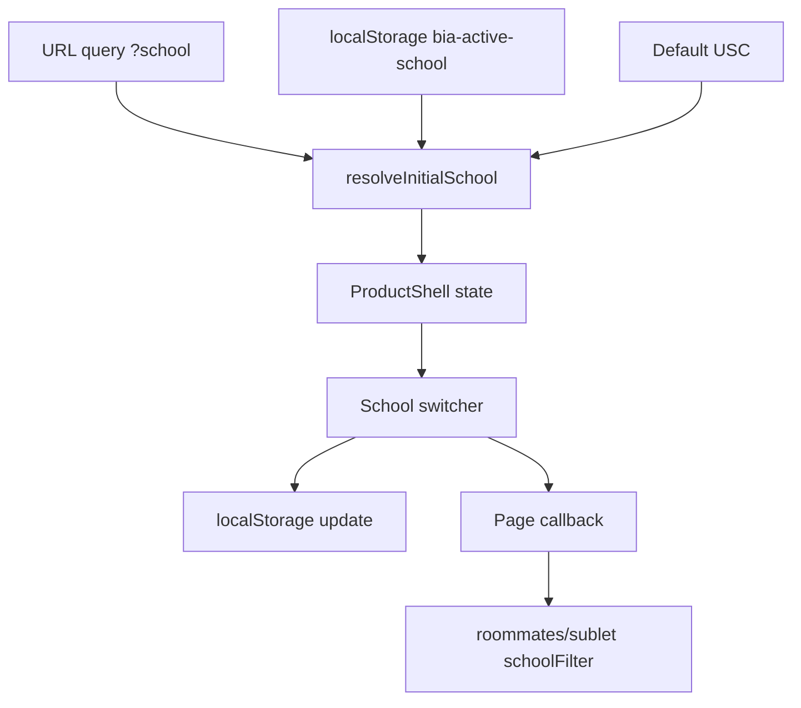

# Product Shell Redesign Plan

## Status

Workflow: A formal flow, step 7 design-html complete.

Scope: Redesign product pages and shared product navigation. Do not change the landing page at `/`.

## Problem

BIA currently has a strong landing page design language, but product pages under paths like `/roommates`, `/sublet`, `/course-planner`, `/course-rating`, `/shipping`, `/squad`, and `/usc-group` feel like separate tools with a flat tab bar.

The target product is different: a multi-school, one-stop student services platform where users first operate in a school context, then choose a service category.

Current product navigation problems:

- It exposes individual features as peer-level tabs, which makes the platform feel like a tool collection.
- It does not make the current school context obvious.
- It does not explain that every school can use the platform while still prioritizing the user's own school.
- It visually diverges from the landing page, so `/` and product pages feel like different products.
- It mixes high-frequency tasks, community pages, and operational tools in one row.

## Product Goal

Create a unified product shell for all product pages that:

- Keeps `/` as the brand landing page.
- Makes `School` the primary context for product usage.
- Groups product pages by student task domain.
- Reuses the landing page's product polish and spacing rhythm while keeping the current product color palette.
- Supports USC, UC Berkeley, and Stanford without making non-USC users feel secondary.
- Defaults the experience to the user's selected or saved school.

## Non-Goals

- Do not redesign the landing page in this project.
- Do not rewrite all product page internals in the first pass.
- Do not change API route prefixes.
- Do not introduce a new auth system.
- Do not require every product to support every school before the shell ships.
- Do not remove existing feature URLs.

## Target IA

Top-level product shell:

- Brand: `BIA Starter`
- School switcher: `USC`, `UC Berkeley`, `Stanford`
- Primary groups:
  - Housing
  - Courses
  - Services
  - Community
  - Account

Group mapping:

- Housing:
  - `/roommates`
  - `/sublet`
  - `/submit`
  - `/sublet-submit`
- Courses:
  - `/course-planner`
  - `/course-rating`
  - `/course-rating/rankings`
- Services:
  - `/shipping`
  - `/squad`
- Community:
  - `/usc-group`
  - `/join`
  - `/blog`
- Account:
  - `/account`
  - auth entry
  - admin entry only for admins

## School Context

School should be a product-level context, not just a filter.

Priority order (matches `resolveInitialProductSchool` in `lib/product-school.ts`):

1. Query param `?school=`.
2. Last selected school in localStorage.
3. Default `USC`.

Behavior:

- Product shell always displays the active school.
- Changing school updates local UI context and localStorage.
- Existing pages that already filter by school should initialize from active school.
- School change should not silently edit the user's profile.
- URLs can keep query params for compatibility in the first pass.

Recommended v1 implementation:

- Use query/localStorage based school context.
- Do not move to `/usc/roommates` style routing yet.
- Preserve existing URLs for sharing and SEO continuity.

## Visual Direction

Use the current product color palette as the visual source:

- Warm `--beige` / `--cream` base.
- Cardinal and gold remain the primary accent system.
- Glass or translucent product header is acceptable if it uses current product colors.
- Editorial typography can echo the landing page, but product pages remain task-first.
- Less brutalist black-border density than current product pages, without introducing a new palette.
- Product pages should feel like an app layer belonging to the landing page, not a separate microsite.

The product shell should be quieter than the landing hero:

- Product pages are task-first.
- Avoid giant decorative hero sections on every product page.
- Use compact contextual headers, grouped navigation, search/filter surface, and active-school chips.

## Proposed Layout

Desktop product shell:

- Sticky top product header.
- Left: BIA Starter mark.
- Center: grouped nav with dropdown/mega menu.
- Right: school switcher, feedback, account.
- Secondary row when useful: current group, active page, school-filter state.

Mobile product shell:

- Top: BIA Starter + account icon.
- School context can move into the page header as a chip if the top bar gets crowded.
- Bottom nav: Housing, Courses, Services, Community.
- Current product page gets a compact in-page subnav.

## Page-Specific Changes

### `/roommates`

Position as Housing > Roommates.

First viewport:

- Current school chip.
- Primary CTA: browse roommate profiles.
- Secondary CTA: drop my profile.
- Trust line: school community, profile control, report/feedback.

Default filters:

- Initialize school filter from product school context.
- Keep ability to switch to all schools.

### `/sublet`

Position as Housing > Sublets.

First viewport:

- Current school chip.
- Primary CTA: browse sublets.
- Secondary CTA: post sublet.
- Trust line: verified/community listings, report/feedback.

Default filters:

- Initialize school filter from product school context.

### `/course-planner`

Position as Courses > Planner.

Header should explain:

- Plan schedules for the active school.
- Keep mode controls inside the page, not top nav.

### `/course-rating`

Position as Courses > Ratings.

Header should explain:

- Student course reviews for the active school.
- Search is the primary action.

### `/shipping`

Position as Services > Shipping.

Note:

- If shipping is USC-only operationally, label it clearly as `USC service`.
- Do not let Berkeley/Stanford users think it is available if it is not.

### `/squad`

Position as Services > Find Squad.

Default filters:

- Add or expose school context when data supports it.

### `/usc-group`

Position as Community > Freshman Groups.

Concern:

- Page name is USC-specific. If platform is multi-school, this should become a school-aware community page later.

## Data/Product Questions

Need answers before full implementation:

- Is shipping USC-only for now?
- Should course planner/rating support non-USC schools today, or only visually prepare for it?
- Do Berkeley and Stanford currently have real roommate/sublet inventory?
- Should unauthenticated users be forced to choose school immediately, or can default USC stand?
- Is `BIA Starter` the final product name, or should product shell use another name?

## Implementation Plan

Phase 1, product shell demo in app:

- Create `ProductShell`.
- Create school context helper.
- Replace `NavTabs` with grouped shell on product pages.
- Keep old URLs.
- Migrate `/roommates` and `/sublet`.
- Verify desktop and mobile.

Phase 2, extend to all products:

- Migrate `/course-planner`, `/course-rating`, `/shipping`, `/squad`, `/usc-group`, `/account`.
- Add per-group subnav.
- Add route-aware active states.
- Add school-aware page headers.

Phase 3, polish and trust:

- Add trust copy to housing pages.
- Add school-aware metadata for core pages.
- Fix landing nav dead links or align links to existing pages.
- Add visual review pass.

## Success Criteria

- Product pages feel like one platform, not separate tools.
- User can identify active school within 2 seconds.
- User can find roommate, sublet, course, service, and community paths without scanning a long flat tab bar.
- `/` remains unchanged.
- Existing product URLs still work.
- Mobile navigation is usable with one thumb.
- Default school context applies consistently to at least `/roommates` and `/sublet`.

## Risks

- Some services may not really be multi-school yet. The UI must not overpromise.
- Current product page styles are strongly brutalist; visual migration should be incremental to avoid large regressions.
- School context can conflict with logged-in profile school if not clearly scoped.
- Query param and localStorage behavior need careful testing to avoid confusing filter state.

## Issue Breakdown Draft

Parent PRD: `docs/product-shell-redesign-plan.md`

### 1. Create Shared Product Shell With Grouped Navigation

Type: AFK

Blocked by: None

What to build:

Create a shared product-page shell that can replace the current flat `NavTabs` on selected product pages. The shell should keep existing product URLs, use the current product color palette, expose a school switcher on desktop, group navigation into Housing, Courses, Services, and Community, and provide a mobile bottom navigation.

Acceptance criteria:

- [ ] Product shell renders without changing `/`.
- [ ] Desktop nav shows brand, school selector, grouped navigation, feedback, and account entry.
- [ ] Mobile nav shows compact top bar and bottom task-domain navigation.
- [ ] Active group and active route are visually clear.
- [ ] Existing auth/admin account affordances are preserved or safely degraded.

User stories addressed:

- User can tell this is one student services platform.
- User can find housing, courses, services, and community without scanning a long flat tab list.
- User can identify the current school context.

### 2. Add Product School Context Helper

Type: AFK

Blocked by: Issue 1 can be built in parallel, but integration depends on both.

What to build:

Add a small school context helper for product pages. It should resolve active school from query param, localStorage, user/profile data where available, and default to USC. Switching school should update localStorage and preserve route compatibility.

Acceptance criteria:

- [ ] Active school resolves predictably with documented priority.
- [ ] School switcher updates UI state and localStorage.
- [ ] `?school=USC`, `?school=UC%20Berkeley`, and `?school=Stanford` initialize correctly.
- [ ] Switching school does not silently edit the user's profile.
- [ ] Helper can be consumed by `/roommates` and `/sublet`.

User stories addressed:

- User sees their own school first.
- User can switch to another school when browsing cross-school content.

### 3. Migrate `/roommates` Into Product Shell

Type: AFK

Blocked by: Issues 1 and 2

What to build:

Wrap `/roommates` in the product shell and initialize its school filter from active school context. Adjust the first viewport to match the new platform IA: Housing > Roommates, browse-first primary action, drop profile as secondary action, and a short trust line.

Acceptance criteria:

- [ ] `/roommates` uses `ProductShell`.
- [ ] Existing profile loading, filtering, profile modal, likes, and submit flow still work.
- [ ] School filter initializes from product school context.
- [ ] User can still choose `ALL` schools from the page filters.
- [ ] First viewport communicates current school, browsing, posting, and trust.
- [ ] Desktop and mobile layouts have no horizontal overflow.

User stories addressed:

- User can browse roommate profiles for their school first.
- User can still publish their own profile.
- User understands why the marketplace is trustworthy enough to try.

### 4. Migrate `/sublet` Into Product Shell

Type: AFK

Blocked by: Issues 1 and 2

What to build:

Wrap `/sublet` in the product shell and initialize its school filter from active school context. Adjust the first viewport to match Housing > Sublets, browse-first primary action, post listing as secondary action, and a short trust line.

Acceptance criteria:

- [ ] `/sublet` uses `ProductShell`.
- [ ] Existing listing loading, filtering, sorting, modal, pagination, and submit route still work.
- [ ] School filter initializes from product school context.
- [ ] User can still choose `ALL` schools from the page filters.
- [ ] First viewport communicates current school, browsing, posting, and trust.
- [ ] Desktop and mobile layouts have no horizontal overflow.

User stories addressed:

- User can browse sublets for their school first.
- User can still post a listing.
- User understands that listings are community-oriented and reportable.

### 5. Product Shell Visual QA And Regression Pass

Type: HITL

Blocked by: Issues 1, 3, and 4

What to build:

Run a focused visual and behavioral QA pass on the first migrated product slice. Compare against the approved demo direction and the existing product color palette. Fix regressions before expanding to courses, services, and community pages.

Acceptance criteria:

- [ ] `/` landing page is unchanged.
- [ ] `/roommates` and `/sublet` are visually coherent with the approved product-shell direction.
- [ ] Desktop and mobile screenshots are reviewed.
- [ ] School switching behavior is verified on both migrated pages.
- [ ] Existing submit, modal, filter, auth, and feedback entry points are smoke-tested.
- [ ] Open follow-up issues are created for course/service/community migration.

User stories addressed:

- User experiences the first migrated pages as one platform.
- Product team can approve or reject the direction before broader rollout.

## Interface Design

This section compares implementation interfaces for the product shell and school context. The selected design should keep product pages easy to migrate one by one without forcing a full rewrite.

### Design A: Thin Layout Wrapper

Interface signature:

```tsx
type ProductGroup = "housing" | "courses" | "services" | "community";

type ProductShellProps = {
  activeGroup: ProductGroup;
  activePath: string;
  children: React.ReactNode;
};

function ProductShell(props: ProductShellProps): JSX.Element;
```

Usage example:

```tsx
<ProductShell activeGroup="housing" activePath="/roommates">
  <RoommatesContent />
</ProductShell>
```

What this hides:

- Product navigation rendering.
- Desktop grouped nav.
- Mobile bottom nav.
- Account/admin/feedback placement.

What it does not hide:

- School state.
- Query param handling.
- Page-specific filter initialization.

Trade-off:

This is the smallest interface, but it pushes school context complexity into every page. It would be easy to start with and easy to misuse later.

### Design B: Shell Owns School Context

Interface signature:

```tsx
type ProductGroup = "housing" | "courses" | "services" | "community";
type ProductPage = "roommates" | "sublet" | "course-planner" | "course-rating" | "shipping" | "squad" | "usc-group";
type School = "USC" | "UC Berkeley" | "Stanford";

type ProductShellProps = {
  group: ProductGroup;
  page: ProductPage;
  children: (ctx: ProductShellContext) => React.ReactNode;
};

type ProductShellContext = {
  school: School;
  setSchool: (school: School) => void;
  isSchoolScoped: boolean;
};

function ProductShell(props: ProductShellProps): JSX.Element;
```

Usage example:

```tsx
<ProductShell group="housing" page="roommates">
  {({ school, setSchool }) => (
    <RoommatesContent initialSchool={school} onSchoolChange={setSchool} />
  )}
</ProductShell>
```

What this hides:

- Product navigation rendering.
- School resolution priority.
- School localStorage persistence.
- Query param school initialization.
- Route-aware nav active state.
- Desktop and mobile shell differences.

Trade-off:

This is a deeper interface. Pages get the active school explicitly, and the shell owns the platform-level concern. The render-prop shape is slightly more verbose, but it prevents each product page from inventing its own school behavior.

### Design C: Global Product Provider Plus Layout

Interface signature:

```tsx
type ProductProviderProps = {
  children: React.ReactNode;
};

function ProductProvider(props: ProductProviderProps): JSX.Element;
function useProductContext(): ProductShellContext;

type ProductShellProps = {
  group: ProductGroup;
  page: ProductPage;
  children: React.ReactNode;
};

function ProductShell(props: ProductShellProps): JSX.Element;
```

Usage example:

```tsx
<ProductProvider>
  <ProductShell group="housing" page="roommates">
    <RoommatesContent />
  </ProductShell>
</ProductProvider>
```

Inside the page:

```tsx
const { school, setSchool } = useProductContext();
```

What this hides:

- Same shell behavior as Design B.
- Allows deeply nested components to read school context without prop drilling.

Trade-off:

This is flexible, but it introduces global context before the first two pages prove the need. It is more convenient for broad rollout, but more surface area than necessary for the first slice.

### Recommended Interface

Choose Design B for the first implementation.

Reasoning:

Design B is the best fit for the current scope. The school context is platform-level, so it belongs in the shell. At the same time, only `/roommates` and `/sublet` need to consume it in v1, so a full global provider is premature. The render-prop interface keeps the school dependency visible at the page boundary, which makes migration safer.

Recommended component shape:

```tsx
<ProductShell group="housing" page="roommates">
  {({ school, setSchool }) => (
    <RoommatesContent initialSchool={school} onSchoolChange={setSchool} />
  )}
</ProductShell>
```

Recommended supporting helper:

```ts
type School = "USC" | "UC Berkeley" | "Stanford";

function normalizeSchool(value: string | null | undefined): School | null;
function readStoredSchool(): School | null;
function writeStoredSchool(school: School): void;
function schoolToQueryValue(school: School): string;
```

Desktop shell anatomy:

- Brand link to `/`
- School switcher
- Grouped nav with hover/focus menu
- Feedback action
- Account/admin/sign-in actions

Mobile shell anatomy:

- Compact top bar with brand and account/sign-in
- School context shown as an in-page chip for migrated pages
- Bottom nav with Housing, Courses, Services, Community

Route grouping:

```ts
const PRODUCT_NAV_GROUPS = [
  {
    id: "housing",
    label: "住房",
    items: [
      { href: "/roommates", label: "找室友" },
      { href: "/sublet", label: "转租" },
    ],
  },
  {
    id: "courses",
    label: "选课",
    items: [
      { href: "/course-planner", label: "选课规划" },
      { href: "/course-rating", label: "课评" },
    ],
  },
  {
    id: "services",
    label: "服务",
    items: [
      { href: "/shipping", label: "集运" },
      { href: "/squad", label: "找搭子" },
    ],
  },
  {
    id: "community",
    label: "社群",
    items: [
      { href: "/usc-group", label: "新生群" },
      { href: "/join", label: "加入 BIA" },
    ],
  },
];
```

Implementation note:

The first code pass should avoid changing internal business logic for likes, modals, pagination, Supabase queries, or submit flows. The first pass changes page shell, active school initialization, and first-viewport framing only.

## Engineering Review

Verdict: Proceed with a narrow first implementation. Do not replace `NavTabs` globally.

### Current Code Observations

- `components/NavTabs.tsx` is imported by many product pages.
- `lib/types.ts` already defines `SCHOOL_OPTIONS = ["USC", "UC Berkeley", "Stanford"]`.
- `/roommates` and `/sublet` already have local `schoolFilter` state and campus tabs.
- `/sublet` already syncs filters to query params; `/roommates` does not.
- The app has global `FeedbackButton` in `app/layout.tsx`, so product shell should not create a second feedback modal unless it reuses the existing trigger pattern or links to the same behavior later.
- `useAuth()` exposes user, loading, isAdmin, and signOut, but not profile school. v1 should not attempt to infer profile school unless account data is already available in a page.

### Approved First-Pass File Plan

Add:

- `lib/product-school.ts`
- `components/ProductShell.tsx`

Modify:

- `app/roommates/page.tsx`
- `app/sublet/page.tsx`
- `docs/product-shell-redesign-plan.md` only if implementation discoveries change the plan

Do not modify in first pass:

- `app/page.tsx`
- `components/NavTabs.tsx`
- Course pages
- Shipping pages
- Squad pages
- Account/admin pages
- API routes
- Supabase schema

### Data Flow



Resolution order for v1:

1. Query param `school`
2. localStorage `bia-active-school`
3. default `USC`

Profile school is intentionally deferred because `AuthProvider` does not expose profile data today.

### Product School Helper

Recommended constants and functions:

```ts
export type ProductSchool = (typeof SCHOOL_OPTIONS)[number];

export const PRODUCT_SCHOOL_STORAGE_KEY = "bia-active-school";

export function normalizeProductSchool(value: unknown): ProductSchool | null;
export function readStoredProductSchool(): ProductSchool | null;
export function writeStoredProductSchool(school: ProductSchool): void;
export function schoolToQueryValue(school: ProductSchool): string;
```

Notes:

- All localStorage functions must guard `typeof window === "undefined"`.
- Query parsing should accept exact school names and common lowercase slugs: `usc`, `berkeley`, `uc-berkeley`, `stanford`.
- Invalid values fall back cleanly.

### ProductShell Component Contract

```tsx
type ProductGroup = "housing" | "courses" | "services" | "community";
type ProductPage =
  | "roommates"
  | "sublet"
  | "course-planner"
  | "course-rating"
  | "shipping"
  | "squad"
  | "usc-group";

type ProductShellContext = {
  school: ProductSchool;
  setSchool: (school: ProductSchool) => void;
};

type ProductShellProps = {
  group: ProductGroup;
  page: ProductPage;
  children: (ctx: ProductShellContext) => React.ReactNode;
};
```

### ProductShell Behavior

Desktop:

- Brand links to `/`.
- School selector is visible.
- Group nav is visible.
- Active group is highlighted.
- Account/admin/sign-in actions mirror current `NavTabs` behavior.

Mobile:

- Compact top shell.
- Bottom nav with four groups.
- School selector may be compact, but must not cause horizontal overflow.
- If compact school selector is risky, show active school as a chip in the page header for v1.

### `/roommates` Migration

Recommended refactor:

- Rename inner component `HomeContent` to `RoommatesContent`.
- Add props:

```ts
type RoommatesContentProps = {
  initialSchool?: string;
  onSchoolChange?: (school: ProductSchool) => void;
};
```

Behavior:

- Initialize `schoolFilter` from `initialSchool`.
- Keep campus tabs including `ALL`.
- When campus tab changes to a real school, update shell via `onSchoolChange`.
- If user selects `ALL`, do not overwrite active product school.
- Replace top `<NavTabs />` with `ProductShell`.
- Keep existing fetch, like, modal, toast, and filtering logic.

### `/sublet` Migration

Recommended refactor:

- Add props to `SubletContent`:

```ts
type SubletContentProps = {
  initialSchool?: string;
  onSchoolChange?: (school: ProductSchool) => void;
};
```

Behavior:

- Initialize `schoolFilter` from query param if present, otherwise from `initialSchool`.
- Keep existing URL sync logic.
- When campus tab changes to a real school, update shell via `onSchoolChange`.
- If user selects `ALL`, do not overwrite active product school.
- Replace top `<NavTabs />` with `ProductShell`.
- Keep existing fetch, modal, pagination, sorting, and filtering logic.

### Test Plan

Automated:

- Add or update unit tests for `normalizeProductSchool`.
- Run `pnpm test` if dependencies are available.
- Run `pnpm lint` if dependencies are available.

Manual smoke:

- `/` visually unchanged.
- `/roommates` loads.
- `/roommates?school=Stanford` initializes Stanford.
- `/roommates` school tab changes update product shell school.
- `/sublet` loads.
- `/sublet?school=UC%20Berkeley` initializes UC Berkeley.
- `/sublet` sorting and search still work.
- Login/account/admin affordances still render correctly.
- Mobile viewport has no horizontal overflow.

Known environment risk:

- Local dependency installation previously failed because private package access requires `NODE_AUTH_TOKEN`. If tests/build cannot run locally, document that clearly and verify with static checks plus any available production-safe commands.

### Implementation Risks

- Render-prop shell around client components may require careful placement around `Suspense`.
- `useSearchParams()` in both shell and page can create redundant query parsing. Prefer page-level query for page filters and helper for shell state.
- Product shell should not add a second floating feedback button because `FeedbackButton` already exists globally.
- Global `NavTabs` should remain until all product pages migrate.

### Engineering Recommendation

Proceed to implementation only after design review confirms visual details. Build in this order:

1. `lib/product-school.ts` + tests.
2. `components/ProductShell.tsx`.
3. Migrate `/roommates`.
4. Migrate `/sublet`.
5. Run verification and visual QA.

## Design Review

Verdict: Proceed with the approved current-color product shell direction, with mobile navigation constrained before implementation.

### Dimension Scores

- Information architecture clarity: 8/10. Grouping by Housing, Courses, Services, and Community makes the product feel like a platform instead of a row of unrelated tools. To reach 10/10, later pages need school-aware availability labels so USC-only services do not appear equally available to every school.
- Visual continuity: 8/10. The demo now keeps the current product palette: `--beige`, `--cream`, `--cardinal`, `--gold`, and dark ink. To reach 10/10, the implementation should reduce black-border density without turning the product into a new glass/teal visual system.
- Landing-page compatibility: 8/10. The product shell can borrow landing-page polish, typography rhythm, and sticky header treatment while leaving `/` unchanged. To reach 10/10, product pages should avoid landing-style giant heroes and stay optimized for browsing, filtering, and posting.
- Mobile usability: 7/10. Bottom domain navigation is the right direction, but the top bar cannot carry brand, school selector, account, and actions at once. To reach 10/10, mobile should show brand/account in the top bar, active school in the page header chip, and domain navigation at the bottom.
- Implementation fidelity risk: 7/10. The direction is shippable if the first pass only migrates `/roommates` and `/sublet`. Risk rises if `NavTabs` is replaced globally or product page internals are redesigned at the same time.

### Design Locks

- Do not change the landing page at `/`.
- Do not introduce a new color palette or per-school theme switching.
- Use the existing product palette: `--beige`, `--cream`, `--cardinal`, `--gold`, `--black`, and current school accent helpers only where existing page cards already rely on them.
- Product shell active state uses cardinal; gold is supporting emphasis, not a full background theme.
- Desktop uses grouped top navigation with domain menus.
- Mobile uses compact top chrome plus bottom domain navigation.
- Mobile school context can live in the migrated page header as a chip instead of the top nav.
- `/roommates` and `/sublet` first viewports should be task-first: current school, browse action, post action, and a short trust line.
- Avoid a full landing-page hero treatment on product pages.
- Do not add duplicate feedback UI because the app already has a global feedback button.
- Preserve current business logic, filters, modals, likes, pagination, and submit routes.

### Implementation Guidance From Design Review

The first implementation should treat `ProductShell` as a product navigation and context layer, not a full visual rewrite. It should make the pages feel more coherent by replacing the flat nav, adding school context, and reframing the first viewport. The card grid, listing behavior, form flows, and Supabase data paths should remain stable.

The demo file at `public/product-shell-demo.html` is approved only as a direction reference. It should not be copied literally where it would create oversized product-page hero sections, hover-only menus without keyboard support, or mobile overflow.

## Product Shell Design Consultation

This consultation is intentionally constrained. The project does not need a new brand system for this slice. It needs a product-shell system that bridges the polished landing page and the existing product pages without changing the color palette.

### Existing System Read

- `app/globals.css` already defines two visual systems: landing tokens and product-page brutalist tokens.
- Product pages currently rely on `--beige`, `--cream`, `--black`, `--cardinal`, `--gold`, `--mid`, and school accent helpers.
- Landing pages rely on glass, muted editorial spacing, darker nav surfaces, and teal/navy accents.
- `components/NavTabs.tsx` is the main IA problem: one horizontal row treats rooming, sublet, course planning, course ratings, shipping, squad, and USC groups as equal tabs.
- `/roommates` and `/sublet` also currently override `--cardinal` and `--gold` when Berkeley or Stanford is selected. That makes the whole page feel like it has changed brands. The new shell should not continue that behavior.

### Design Principle

The product shell should feel like BIA grew from a USC tool into a student services platform. It should not feel like a new app was bolted onto the repo.

Use landing-page craft:

- More breathing room than the old tab bar.
- A sticky, calm, high-confidence top shell.
- Clear hierarchy between platform context, product domain, and page-level filters.
- Softer surfaces than full brutalist slabs where navigation is concerned.

Keep product-page identity:

- Cream and beige page base.
- Cardinal active states.
- Gold as accent and emphasis.
- Display typography for page identity.
- Existing card/filter components can remain more brutalist during the first slice.

### Navigation System

Top-level domains:

- Housing: `/roommates`, `/sublet`, `/submit`, `/sublet-submit`
- Courses: `/course-planner`, `/course-rating`, `/course-rating/rankings`
- Services: `/shipping`, `/squad`
- Community: `/usc-group`, `/join`, `/blog`

Desktop behavior:

- Left: BIA mark linking to `/`.
- Center: domain nav, not individual feature tabs.
- Domain menus expose 2-4 concrete links.
- Right: school selector plus auth/account/admin affordances.
- Active domain is cardinal.
- Current route should be visible inside the domain menu and through page header copy.

Mobile behavior:

- Top bar only carries BIA mark and account/sign-in.
- Bottom nav carries Housing, Courses, Services, Community.
- Active school appears in the page header chip, not in the top nav.
- Page-level filters keep the ability to choose `ALL`.

This matters because mobile users are not trying to understand the platform taxonomy. They are trying to find a room, a sublet, or a class while walking between things. The nav must be thumb-reachable and not horizontally scroll.

### School Context System

School is a platform context, not a visual theme.

Approved behavior:

- Changing school updates context and default filters.
- Changing school does not recolor the whole product shell.
- Query params and localStorage can initialize school in v1.
- Selecting `ALL` in page filters should not overwrite the saved product school.

Approved presentation:

- Desktop: school selector in the shell.
- Mobile: active school chip in the page header.
- Housing pages can say `当前学校 USC` or `Showing USC first`.
- Do not claim a service is available for a school unless the product actually supports it.

### Page Header System

`/roommates` and `/sublet` should not copy the demo's large landing-style hero literally. The first viewport should be a compact task header plus filters.

Recommended anatomy:

- Breadcrumb/domain label: `Housing / Roommates` or `Housing / Sublets`.
- School chip: active school.
- H1: direct task name, not a marketing headline.
- Support copy: one sentence about what the user can do.
- Primary action: browse content or focus the listing area.
- Secondary action: post profile/listing.
- Trust line: community moderation, profile control, reporting, or school-first inventory.

For `/roommates`, browse should be the primary mental model. `DROP MY PROFILE` remains important, but the page should first prove there are people to browse.

For `/sublet`, browse and search should be primary. `POST MY SUBLET` remains secondary until the user has seen inventory.

### Component-Level Design Rules

- `ProductShell` can use rounded corners up to `12px`; product cards can keep existing harder brutalist geometry.
- Avoid nested cards. The shell is chrome, not a card around the whole page.
- Avoid hover-only navigation as the only access path. Menus need click/focus support when implemented.
- Do not add another floating feedback control because `FeedbackButton` already exists in `app/layout.tsx`.
- Preserve current listing cards, modals, likes, pagination, search, sort, and submit flows in the first implementation.
- Keep typography tighter inside nav. Do not use giant display type in the shell itself.
- No teal, navy, blue-feature, or landing dark glass inside migrated product pages unless already present on that product page.

### Consultation Verdict

Proceed with the narrowed product shell. The system should solve the PM problem first: students see their school, choose a task domain, and then browse or post inside the current product. Visual polish is in service of that navigation logic, not a separate redesign project.

## Design Shotgun

Scope: constrained layout exploration for the approved product shell. This is not a new visual style exploration. Colors, typography family, product palette, and landing-page non-goals remain locked.

Tool note: local `design` and `browse` binaries were not available in this environment, so this shotgun uses implementation-ready wireframe variants instead of generated image boards.

### Variant A: Task Header Shell

This is the recommended variant.

Desktop:

- Sticky product shell at top.
- Compact domain nav with click/focus menus.
- Page starts with a short task header.
- Header left side: domain label, school chip, H1, one-line support copy, trust line.
- Header right side: small action cluster for post profile/listing and account state if needed.
- Filters sit immediately below the header.
- Listing grid starts above the fold on most laptop screens.

Mobile:

- Top shell: BIA mark and account/sign-in.
- Page header: school chip, H1, one-line support copy.
- Primary/secondary actions stack under the header.
- Filters follow.
- Bottom nav handles domains.

Why it works:

- Best balance between platform clarity and browsing speed.
- Does not hide inventory behind a marketing hero.
- Easiest to migrate `/roommates` and `/sublet` without touching listing cards and modals.
- Mobile has the fewest overflow risks.

Risks:

- Less visually dramatic than the demo.
- Needs good spacing and copy discipline to avoid feeling like old pages with a new nav.

Completeness: 9/10 for the first implementation slice.

### Variant B: Campus Command Center

Desktop:

- Product shell at top.
- First viewport is a dashboard-like surface.
- Left: selected school and domain overview.
- Center: quick links for Roommates, Sublets, Course Reviews.
- Right: account/community/trust widgets.
- Product-specific filters begin in the second viewport.

Mobile:

- Summary modules stack before filters and listings.

Why it works:

- Makes the one-stop platform vision very obvious.
- Good future pattern for `/account` or a logged-in home page.

Risks:

- Bad first slice for `/roommates` and `/sublet` because users came to browse inventory.
- Pushes listings lower on the page.
- Introduces dashboard logic before the platform has enough cross-product state.

Completeness: 6/10 for this slice, 8/10 later for a logged-in product home.

### Variant C: Persistent Left Rail

Desktop:

- Product shell becomes a left rail.
- School selector sits at the top of the rail.
- Domains are vertical sections.
- Page content gets maximum vertical space.

Mobile:

- Rail collapses to bottom nav.

Why it works:

- Strong app feel.
- Scales if BIA later has many internal tools and admin-like workflows.

Risks:

- Too heavy for public marketplace pages.
- Consumes horizontal space on listing grids.
- Visually departs further from current product pages and landing page.
- More invasive implementation because page layouts need wider restructuring.

Completeness: 5/10 for this slice, maybe useful later for admin/account surfaces.

### Shotgun Decision

Choose Variant A: Task Header Shell.

It solves the actual PM problem with the smallest product risk. Students see that BIA is now a platform, see their school context, choose a domain, and still get to listings quickly.

Implementation lock from shotgun:

- Build `ProductShell` as top chrome plus mobile bottom nav.
- Use compact page headers for `/roommates` and `/sublet`.
- Keep listings and filters close to the top.
- Do not build a dashboard home in this slice.
- Do not build a desktop left rail in this slice.
- Do not copy the large demo hero into production pages.

## Design HTML Specification

Mode: plan-driven. No approved PNG, no finalized HTML, and no `DESIGN.md` were found, so this section turns the approved Variant A into a production implementation spec.

Screen name: `product-shell-task-header`.

### Implementation Spec Summary

Colors:

- Page base: `var(--beige)` / `#f2ebd9`
- Surface: `var(--cream)` / `#faf6ec`
- Primary text: `var(--black)` / `#1a1410`
- Muted text: `var(--mid)` / `#8c7e6a`
- Active / primary action: `var(--cardinal)` / `#990000`
- Accent / secondary emphasis: `var(--gold)` / `#ffcc00`

Typography:

- Navigation and compact labels: existing `font-display`, but small and controlled.
- Page H1: existing `font-display`, capped so it does not become a landing hero.
- Body/support copy: existing body font.
- No negative letter spacing and no viewport-width font scaling.

Spacing:

- Shell horizontal padding: `16px` mobile, `24px` tablet, constrained to `1120px` desktop.
- Product shell height: `56px` mobile top, `64px` desktop top.
- Page header vertical padding: `28px` mobile, `40px` desktop.
- Filters start within the first viewport on common laptop screens.
- Mobile bottom nav height: `64px`, page gets matching bottom padding.

Component inventory:

- `ProductShell`
- `ProductShellNavGroup`
- `ProductSchoolSelector`
- `MobileProductNav`
- `ProductTaskHeader`
- Existing page filters
- Existing listing grids/cards
- Existing auth modal/account/admin affordances

### Target Markup Shape

The production structure should look like this conceptually:

```tsx
<ProductShell group="housing" page="roommates">
  {({ school, setSchool }) => (
    <RoommatesContent initialSchool={school} onSchoolChange={setSchool}>
      <ProductTaskHeader
        eyebrow="Housing / Roommates"
        school={school}
        title="找室友"
        description="Browse roommate profiles from your school first, then widen to all schools when you need more options."
        primaryAction={{ label: "Browse profiles", href: "#browse" }}
        secondaryAction={{ label: "Drop my profile", href: "/submit" }}
        trustItems={["School-first profiles", "Profile control", "Report issues"]}
      />
      <RoommatesFilters id="browse" />
      <RoommatesGrid />
    </RoommatesContent>
  )}
</ProductShell>
```

Equivalent `/sublet` shape:

```tsx
<ProductShell group="housing" page="sublet">
  {({ school, setSchool }) => (
    <SubletContent initialSchool={school} onSchoolChange={setSchool}>
      <ProductTaskHeader
        eyebrow="Housing / Sublets"
        school={school}
        title="找转租"
        description="Browse sublets near your school first, then search by rent, room type, and move-in timing."
        primaryAction={{ label: "Browse listings", href: "#browse" }}
        secondaryAction={{ label: "Post sublet", href: "/sublet-submit" }}
        trustItems={["Community listings", "Search and sort", "Report issues"]}
      />
      <SubletFilters id="browse" />
      <SubletGrid />
    </SubletContent>
  )}
</ProductShell>
```

### ProductShell Structure

Desktop:

```html
<div class="product-shell">
  <header class="product-shell__top">
    <a class="product-shell__brand" href="/">BIA</a>
    <nav class="product-shell__domains">
      <button>Housing</button>
      <button>Courses</button>
      <button>Services</button>
      <button>Community</button>
    </nav>
    <label class="product-shell__school">
      <span>School</span>
      <select>...</select>
    </label>
    <div class="product-shell__account">...</div>
  </header>
  <main class="product-shell__main">...</main>
</div>
```

Mobile:

```html
<div class="product-shell">
  <header class="product-shell__mobile-top">
    <a href="/">BIA</a>
    <button>Account</button>
  </header>
  <main class="product-shell__main">...</main>
  <nav class="product-shell__bottom-nav">
    <a href="/roommates">Housing</a>
    <a href="/course-planner">Courses</a>
    <a href="/shipping">Services</a>
    <a href="/usc-group">Community</a>
  </nav>
</div>
```

Implementation notes:

- Domain menus must support click/focus, not hover only.
- Mobile school selection is intentionally not in the top bar.
- The shell should not wrap page content in a decorative card.
- The shell should not create a second feedback button.

### ProductTaskHeader Structure

```html
<section class="product-task-header">
  <div class="product-task-header__copy">
    <div class="product-task-header__eyebrow">Housing / Roommates</div>
    <div class="product-task-header__chips">
      <span>Current school USC</span>
      <span>All schools available</span>
    </div>
    <h1>找室友</h1>
    <p>Browse roommate profiles from your school first...</p>
    <ul>
      <li>School-first profiles</li>
      <li>Profile control</li>
      <li>Report issues</li>
    </ul>
  </div>
  <div class="product-task-header__actions">
    <a class="primary" href="#browse">Browse profiles</a>
    <a class="secondary" href="/submit">Drop my profile</a>
  </div>
</section>
```

Responsive behavior:

- Desktop uses a two-column header only if actions fit naturally.
- Mobile stacks copy, actions, and chips.
- H1 must stay within the content width and avoid hero-scale sizing.
- Trust items can wrap; they must not force horizontal scroll.

### CSS Translation Rules

- Use existing Tailwind utility patterns where already common in these pages.
- Use CSS variables instead of hardcoded duplicate hex values.
- Keep shell borders lighter than old `border-[3px]` product cards.
- Use `border-[2px]` or `border` for shell controls; keep hard `border-[3px]` for existing cards and filters where already used.
- Use `position: sticky` on desktop top shell.
- Use `position: fixed` on mobile bottom nav with `padding-bottom` on the page wrapper.
- Use stable heights for top and bottom navigation so layout does not jump.
- Use `max-w-6xl mx-auto px-4 sm:px-6` as the base content width unless a page already has a stricter container.

### Acceptance Criteria For Final HTML Direction

- `/roommates` first screen shows product shell, school chip, task header, CTAs, and filters without needing to scroll far.
- `/sublet` first screen shows product shell, school chip, task header, CTAs, and filters without needing to scroll far.
- Mobile has no horizontal overflow.
- Mobile bottom nav is visible and domain-based.
- Desktop domain nav replaces the flat feature tab row on migrated pages only.
- Existing listing cards and modals remain visually familiar.
- School switching changes context and filters, not the global color theme.

## Implementation Slice Status

Implemented files:

- `lib/product-school.ts`
- `lib/__tests__/product-school.test.ts`
- `components/ProductShell.tsx`
- `app/roommates/page.tsx`
- `app/sublet/page.tsx`

Scope kept:

- `/` landing page unchanged.
- `components/NavTabs.tsx` unchanged for unmigrated product pages.
- `/roommates` and `/sublet` now use the shared product shell.
- Product pages no longer recolor the entire page when Berkeley or Stanford is selected.
- Existing listing cards, modals, likes, pagination, sorting, and submit routes remain in place.

Verification status:

- `git diff --check` passed.
- `pnpm test lib/__tests__/product-school.test.ts`, `pnpm lint`, and `pnpm exec tsc --noEmit` could not run because dependencies are not installed.
- `pnpm install --no-frozen-lockfile` was attempted with network access and failed because `@biboyang425/bia-shared` requires auth. Current environment has no `NODE_AUTH_TOKEN`, so no authorization header was sent.
